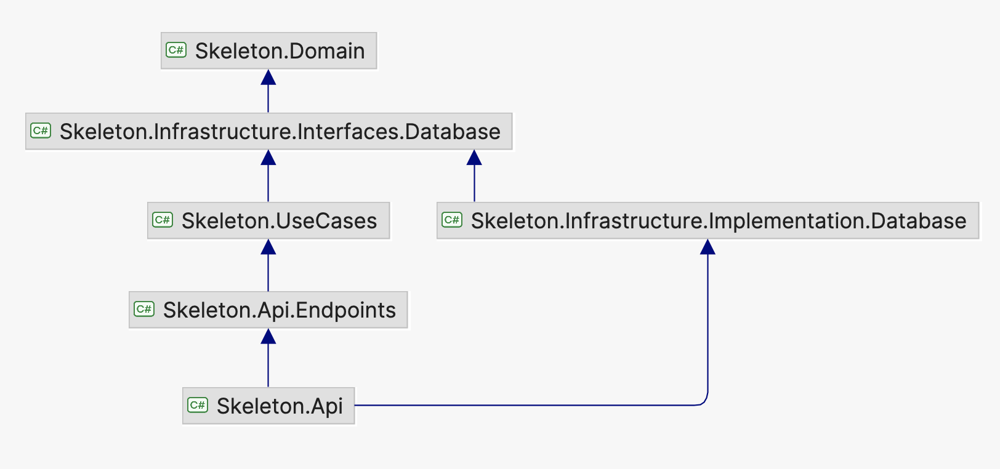

# Templates

This solution contains [↑ custom template](https://learn.microsoft.com/en-us/dotnet/core/tools/custom-templates) for `dotnet new` command.

## Table of contents

- [Templates](#templates)
  - [Table of contents](#table-of-contents)
  - [How to use template](#how-to-use-template)
    - [1. Select folder with template you want to install](#1-select-folder-with-template-you-want-to-install)
    - [2. Install template](#2-install-template)
    - [3. Create new solution based on installed template](#3-create-new-solution-based-on-installed-template)
    - [4. Initialize Git repository and create first commit](#4-initialize-git-repository-and-create-first-commit)
  - [Template descriptions](#template-descriptions)
    - [`skeleton-minimal-api`](#skeleton-minimal-api)
    - [`skeleton-sln`](#skeleton-sln)
    - [`skeleton-console`](#skeleton-console)
    - [`skeleton-api`](#skeleton-api)
    - [`skeleton-cqrs`](#skeleton-cqrs)

## How to use template

### 1\. Select folder with template you want to install

```bash
cd TEMPLATE_FOLDER
```

Here `TEMPLATE_FOLDER` is one of: `skeleton-console`, `skeleton-api`, `skeleton-cqrs`.

### 2\. Install template

```bash
dotnet new install . --force
# dotnet new uninstall . # Uninstalls template
```

### 3\. Create new solution based on installed template

```bash
mkdir SOLUTION_FOLDER && cd SOLUTION_FOLDER
```

```bash
dotnet new skeleton-minial-api --name=SOLUTION_NAME --force
```

or:

```bash
dotnet new skeleton-sln --name=SOLUTION_NAME --force
```

or:

```bash
dotnet new skeleton-console --name=SOLUTION_NAME --force
```

or:

```bash
dotnet new skeleton-api \
--name=SOLUTION_NAME \
--api-port=API_PORT \
--main-entity-name=MAIN_ENTITY_NAME \
--force
```

or:

```bash
dotnet new skeleton-cqrs \
--name=SOLUTION_NAME \
--api-port=API_PORT \
--main-entity-name=MAIN_ENTITY_NAME \
--postgres-port=POSTGRES_PORT \
--force
```

Example:

```bash
mkdir company-notes && cd "$_"
```

```bash
dotnet new skeleton-cqrs \
--name=Company.Notes \
--api-port=8040 \
--main-entity-name=User \
--postgres-port=8050 \
--force
```

At the end type `y` to confirm running `dotnet format` [↑ post action](https://github.com/dotnet/templating/wiki/Post-Action-Registry), which is necessary for sorting `using` directives:

```console
The template "Skeleton Web API" was created successfully.

Processing post-creation actions...
Template is configured to run the following action:
Actual command: dotnet format
Do you want to run this action [Y(yes)|N(no)]?
y
Running command 'dotnet format'...
Command succeeded.
```

### 4\. Initialize Git repository and create first commit

```bash
git init && git add . && git commit --message "Initial commit"
```

## Template descriptions

### `skeleton-minimal-api`

File tree:

```text
├── .editorconfig
├── .gitignore
├── Skeleton.sln
├── readme.md
└── src
    └── Skeleton.Api
        ├── Program.cs
        ├── Properties
        │   └── launchSettings.json
        ├── Skeleton.Api.csproj
        ├── appsettings.Ide.json
        ├── appsettings.json
```

### `skeleton-sln`

File tree:

```text
├── .editorconfig
├── .gitignore
├── Grpc.sln
├── Makefile
└── readme.md
```

### `skeleton-console`

File tree:

```text
├── .editorconfig
├── .gitignore
├── Directory.Build.props
├── Makefile
├── Skeleton.sln
├── readme.md
└── src
    └── Skeleton
        ├── Program.cs
        └── Skeleton.csproj
```

### `skeleton-api`

File tree:

```text
├── .editorconfig
├── .gitignore
├── Directory.Build.props
├── Makefile
├── Skeleton.sln
├── readme.md
├── src
│   └── Skeleton.Api
│       ├── Endpoints
│       │   ├── EndpointsMapperExtension.cs
│       │   └── UserTemplates
│       │       ├── Create
│       │       │   ├── CreateUserTemplateEndpoint.cs
│       │       │   ├── CreateUserTemplateRequest.cs
│       │       │   └── CreateUserTemplateResponse.cs
│       │       ├── Get
│       │       │   ├── GetUserTemplateEndpoint.cs
│       │       │   └── GetUserTemplateResponse.cs
│       │       ├── ...
│       ├── Program.cs
│       ├── Properties
│       │   └── launchSettings.json
│       ├── Skeleton.Api.csproj
│       ├── appsettings.Ide.json
│       ├── appsettings.Production.json
│       └── appsettings.json
└── tests
    ├── Skeleton.Api.IntegrationTests
    │   ├── DefaultWebApplicationFactory.cs
    │   ├── Skeleton.Api.IntegrationTests.csproj
    │   └── UserTemplates
    │       └── CreateUserTemplateEndpointTests.cs
    └── Skeleton.Domain.UnitTests
        ├── Skeleton.Domain.UnitTests.csproj
```

### `skeleton-cqrs`

Solution dependencies:



File tree:

```text
├── .dockerignore
├── .editorconfig
├── .env.example
├── .gitignore
├── Directory.Build.props
├── Makefile
├── Skeleton.sln
├── docker-compose.infrastructure.yml
├── readme.md
├── src
│   ├── Skeleton.Api
│   │   ├── Configurations
│   │   │   ├── ApplicationConfiguration.cs
│   │   │   └── MediatrConfiguration.cs
│   │   ├── Program.cs
│   │   ├── Properties
│   │   │   └── launchSettings.json
│   │   ├── Skeleton.Api.csproj
│   │   ├── appsettings.GitLab.json
│   │   ├── appsettings.Ide.json
│   │   ├── appsettings.Production.json
│   │   └── appsettings.json
│   ├── Skeleton.Api.Endpoints
│   │   ├── EndpointsMapperExtension.cs
│   │   ├── Skeleton.Api.Endpoints.csproj
│   │   └── UserTemplates
│   │       ├── Create
│   │       │   ├── CreateUserTemplateEndpoint.cs
│   │       │   ├── CreateUserTemplateRequest.cs
│   │       │   └── CreateUserTemplateResponse.cs
│   │       ├── Get
│   │       │   ├── GetUserTemplateEndpoint.cs
│   │       │   └── GetUserTemplateResponse.cs
│   │       ├── ...
│   ├── Skeleton.Domain
│   │   ├── Entities
│   │   │   ├── UserTemplate.cs
│   │   │   ├── ...
│   │   ├── Error.cs
│   │   ├── Errors.cs
│   │   └── Skeleton.Domain.csproj
│   ├── Skeleton.Infrastructure.Implementation.Database
│   │   ├── DatabaseConfiguration.cs
│   │   ├── DatabaseContext.cs
│   │   ├── DatabaseErrorMessagesProvider.cs
│   │   ├── DatabaseSettings.cs
│   │   ├── EntityTypeConfigurations
│   │   │   ├── BlogEntityTypeConfiguration.cs
│   │   │   └── UserTemplateEntityTypeConfiguration.cs
│   │   ├── ReadOnlyDatabaseContext.cs
│   │   └── Skeleton.Infrastructure.Implementation.Database.csproj
│   ├── Skeleton.Infrastructure.Interfaces.Database
│   │   ├── IDatabaseContext.cs
│   │   ├── IDatabaseErrorMessagesProvider.cs
│   │   ├── IReadOnlyDatabaseContext.cs
│   │   └── Skeleton.Infrastructure.Interfaces.Database.csproj
│   └── Skeleton.UseCases
│       ├── Skeleton.UseCases.csproj
│       └── UserTemplates
│           ├── Commands
│           │   ├── Create
│           │   │   ├── CreateUserTemplateCommand.cs
│           │   │   ├── CreateUserTemplateCommandHandler.cs
│           │   │   └── CreateUserTemplateDto.cs
│           │   ├── ...
│           └── Queries
│               ├── Get
│               │   ├── GetUserTemplateDto.cs
│               │   ├── GetUserTemplateQuery.cs
│               │   └── GetUserTemplateQueryHandler.cs
│               ├── ...
└── tests
    ├── Skeleton.Api.IntegrationTests
    │   ├── DefaultWebApplicationFactory.cs
    │   ├── Skeleton.Api.IntegrationTests.csproj
    │   └── UserTemplates
    │       └── CreateUserTemplateEndpointTests.cs
    └── Skeleton.Domain.UnitTests
        ├── Skeleton.Domain.UnitTests.csproj
```